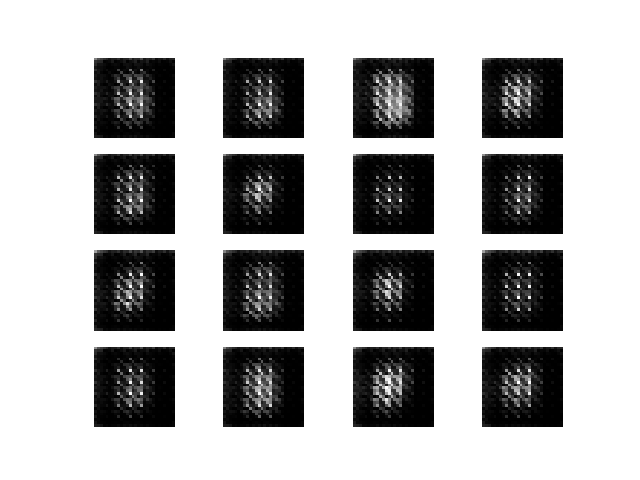
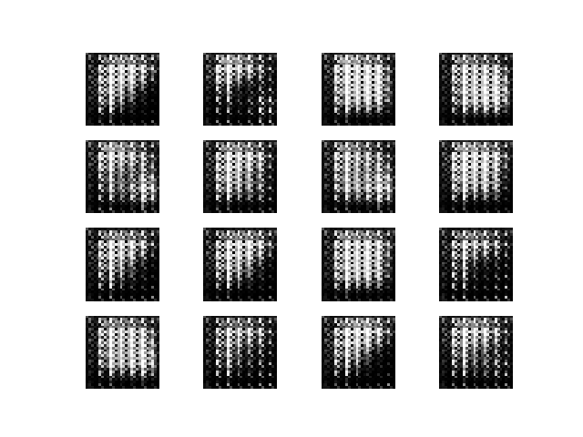
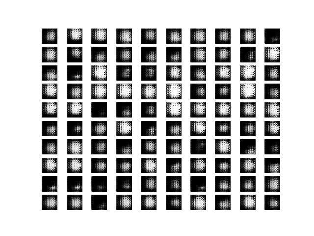
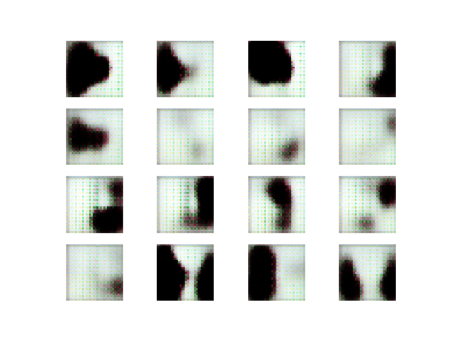
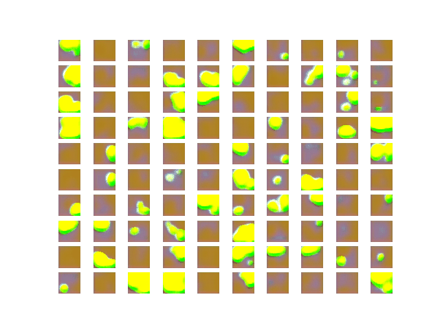
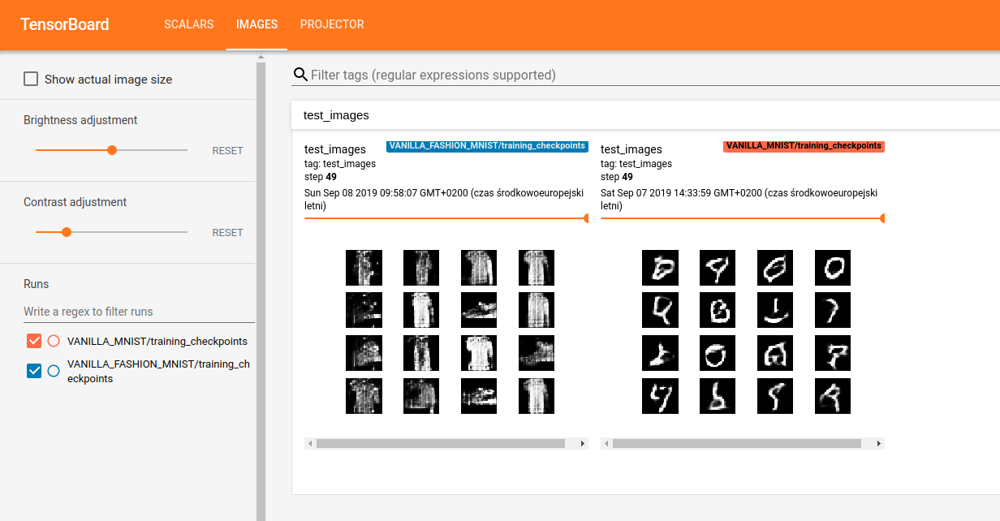

   [](https://travis-ci.com/tlatkowski/gans-2.0) [](https://codecov.io/gh/tlatkowski/gans-2.0)


# GANs 2.0: Generative Adversarial Networks in TensorFlow 2.0

## Project aim

The main aim of this project is to speed up a process of building 
deep learning pipelines that are based on Generative Adversarial Networks 
and simplify prototyping of various generator/discriminator models. 
This library provides several GAN trainers that can be used 
as off-the-shelf features such us: 
* Vanilla GAN
* Conditional GAN
* Cycle GAN
* Wasserstein GAN
* Progressive GAN (WIP)

## Examples

### Function modeling
Vanilla GAN (Gaussian function)            |  Vanilla GAN (sigmoid function)
:-------------------------:|:-------------------------:
  |  

### Image generation
Vanilla GAN (MNIST)            |  Conditional GAN (MNIST)
:-------------------------:|:-------------------------:
  |  


Vanilla GAN (FASHION_MNIST)            |  Conditional GAN (FASHION_MNIST)
:-------------------------:|:-------------------------:
  |  


Vanilla GAN (CIFAR10)            |  Conditional GAN (CIFAR10)
:-------------------------:|:-------------------------:
  |  

### Image translation

Cycle GAN (SUMMER2WINTER)            |  Cycle GAN (WINTER2SUMMER)
:-------------------------:|:-------------------------:
  |  

## Installation

### Installs with *GPU* support
```bash
pip install gans2[tensorflow_gpu]
```

### Installs with *CPU* support
```bash
pip install gans2[tensorflow]
```

## Running training pipeline code examples for Vanilla GAN for MNIST digit generation

#### Pre-defined models
```python
import tensorflow as tf
from easydict import EasyDict as edict

from gans.datasets import mnist
from gans.models.discriminators import discriminator
from gans.models.generators.latent_to_image import latent_to_image
from gans.trainers import optimizers
from gans.trainers import vanilla_gan_trainer

model_parameters = edict({
    'img_height':                  28,
    'img_width':                   28,
    'num_channels':                1,
    'batch_size':                  16,
    'num_epochs':                  10,
    'buffer_size':                 1000,
    'latent_size':                 100,
    'learning_rate_generator':     0.0001,
    'learning_rate_discriminator': 0.0001,
    'save_images_every_n_steps':   10
})

dataset = mnist.MnistDataset(model_parameters)

generator = latent_to_image.LatentToImageGenerator(model_parameters)
discriminator = discriminator.Discriminator(model_parameters)

generator_optimizer = optimizers.Adam(
    learning_rate=model_parameters.learning_rate_generator,
    beta_1=0.5,
)
discriminator_optimizer = optimizers.Adam(
    learning_rate=model_parameters.learning_rate_discriminator,
    beta_1=0.5,
)

gan_trainer = vanilla_gan_trainer.VanillaGANTrainer(
    batch_size=model_parameters.batch_size,
    generator=generator,
    discriminator=discriminator,
    training_name='VANILLA_GAN_MNIST',
    generator_optimizer=generator_optimizer,
    discriminator_optimizer=discriminator_optimizer,
    latent_size=model_parameters.latent_size,
    continue_training=False,
    save_images_every_n_steps=model_parameters.save_images_every_n_steps,
    visualization_type='image',
)

gan_trainer.train(
    dataset=dataset,
    num_epochs=model_parameters.num_epochs,
)

```
#### Custom models
```python
import tensorflow as tf
from easydict import EasyDict as edict
from tensorflow.python import keras
from tensorflow.python.keras import layers

from gans.datasets import mnist
from gans.models import sequential
from gans.trainers import optimizers
from gans.trainers import vanilla_gan_trainer

model_parameters = edict({
    'img_height':                  28,
    'img_width':                   28,
    'num_channels':                1,
    'batch_size':                  16,
    'num_epochs':                  10,
    'buffer_size':                 1000,
    'latent_size':                 100,
    'learning_rate_generator':     0.0001,
    'learning_rate_discriminator': 0.0001,
    'save_images_every_n_steps':   10
})

dataset = mnist.MnistDataset(model_parameters)

generator = sequential.SequentialModel(
    layers=[
        keras.Input(shape=[model_parameters.latent_size]),
        layers.Dense(units=7 * 7 * 256, use_bias=False),
        layers.BatchNormalization(),
        layers.LeakyReLU(),

        layers.Reshape((7, 7, 256)),
        layers.Conv2DTranspose(128, (5, 5), strides=(1, 1), padding='same', use_bias=False),
        layers.BatchNormalization(),
        layers.LeakyReLU(),

        layers.Conv2DTranspose(64, (5, 5), strides=(2, 2), padding='same', use_bias=False),
        layers.BatchNormalization(),
        layers.LeakyReLU(),

        layers.Conv2DTranspose(1, (5, 5), strides=(2, 2), padding='same', use_bias=False, activation='tanh')
    ]
)

discriminator = sequential.SequentialModel(
    [
        keras.Input(
            shape=[
                model_parameters.img_height,
                model_parameters.img_width,
                model_parameters.num_channels,
            ]),
        layers.Conv2D(filters=64, kernel_size=(5, 5), strides=(2, 2), padding='same'),
        layers.LeakyReLU(),
        layers.Dropout(0.3),

        layers.Conv2D(filters=128, kernel_size=(5, 5), strides=(2, 2), padding='same'),
        layers.LeakyReLU(),
        layers.Dropout(rate=0.3),

        layers.Flatten(),
        layers.Dense(units=1),
    ]
)

generator_optimizer = optimizers.Adam(
    learning_rate=model_parameters.learning_rate_generator,
    beta_1=0.5,
)
discriminator_optimizer = optimizers.Adam(
    learning_rate=model_parameters.learning_rate_discriminator,
    beta_1=0.5,
)

gan_trainer = vanilla_gan_trainer.VanillaGANTrainer(
    batch_size=model_parameters.batch_size,
    generator=generator,
    discriminator=discriminator,
    training_name='VANILLA_GAN_MNIST_CUSTOM_MODELS',
    generator_optimizer=generator_optimizer,
    discriminator_optimizer=discriminator_optimizer,
    latent_size=model_parameters.latent_size,
    continue_training=False,
    save_images_every_n_steps=model_parameters.save_images_every_n_steps,
    visualization_type='image',
)

gan_trainer.train(
    dataset=dataset,
    num_epochs=model_parameters.num_epochs,
)
```

#### More code examples
[Vanilla GAN for Gaussian function modeling](./examples/vanilla_gan_function_modeling_gaussian.py)

[Vanilla GAN for sigmoid function modeling](./examples/vanilla_gan_function_modeling_sigmoid.py)

[Conditional GAN for MNIST digit generation](./examples/conditional_gan_mnist.py)

[Cycle GAN for summer2winter/winter2summer style transfer](./examples/cycle_gan_summer2winter.py)

[Wasserstein GAN for MNIST digit generatio](./examples/wasserstein_gan_trainer.py)

## Monitoring model training
In order to visualize a training process (loss values, generated outputs) run the following command in the project directory:
```bash
tensorboard --logdir outputs
```
To follow the training process go to the default browser and type the following address **http://your-workstation-name:6006/** 

The below picture presents the TensorBoard view lunched for two experiments: **VANILLA_MNIST** and **VANILLA_FASION_MNIST**.
 
## References
1. [Deep Convolutional Generative Adversarial Network Tutorial in TensorFlow](https://www.tensorflow.org/beta/tutorials/generative/dcgan)
2. [Cycle GAN Tutorial in TensorFlow](https://www.tensorflow.org/tutorials/generative/cyclegan)
3. [Unpaired Image-to-Image Translation using Cycle-Consistent Adversarial Networks paper](https://arxiv.org/pdf/1703.10593.pdf)
